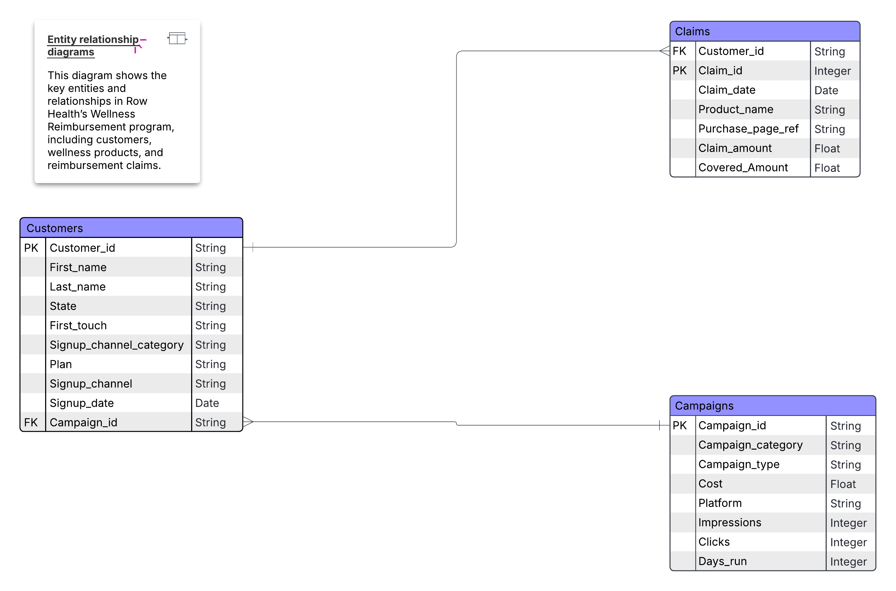
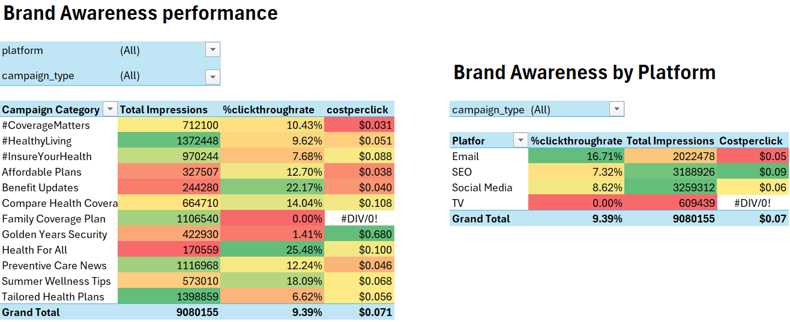
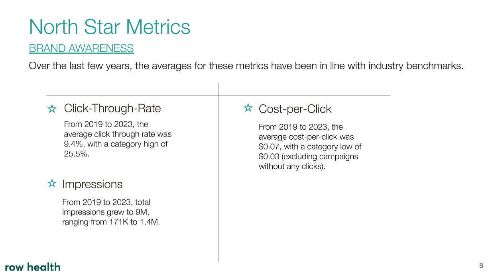
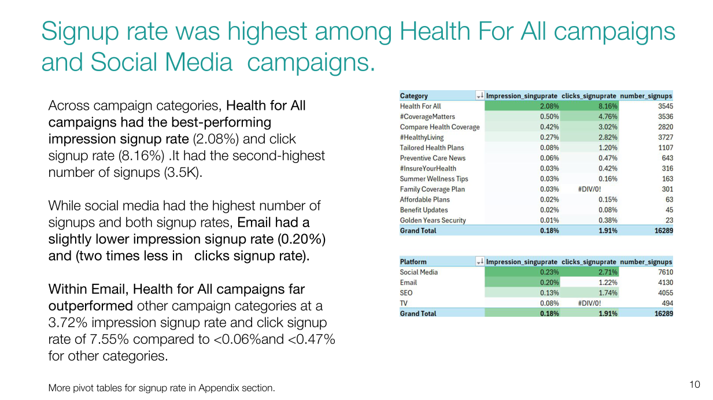
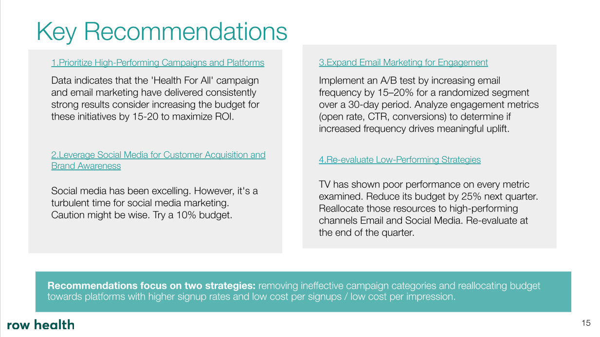
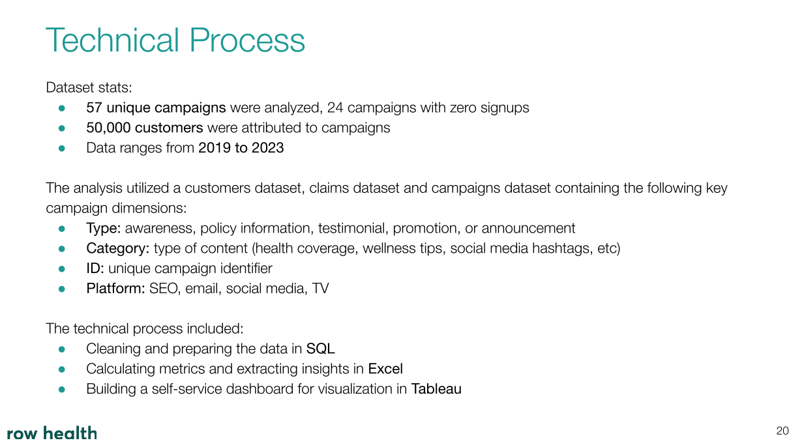

# Table of Contents
 
[Project Summary](#section_1) 
[Part 1: Targeted Insights (SQL)](#section_2) 
[Part 2: Marketing Campaign Analysis (Excel)](#section_3) 
[Part 3: Visualizations (Tableau)](#section_4) 
[Part 4: Recommendations & Next Steps](#section_5) 
[Part 5: Presentation Sample](#section_6) 
[Addendum: Notes on the Marketing Campaign Analysis](#section_7) 

# Project Summary

Established in **2016**, **Row Health** is a cutting-edge insurance company that serves over **100,000** customers across the *United States*.

In **2019**, they introduced the **Wellness Reimbursement** program. This initiative offers subsidies for various wellness products, such as probiotics, digestive enzymes, and stress relief aids, aiming to foster a holistic health approach among their customers.Their customers can sign up for 4 different plans - *bronze, silver, gold, and platinum* - each with different premiums and claim coverage rates.

**Row Health** is reassessing its marketing strategy and budget allocation, so in this project, I take on the role of a data analyst within the patient research team, whose priority is to understand the performance of this reimbursement program . The objective of this project is to analyze the effectiveness of past marketing campaign categories in relation to customer acquisition and subsequent insurance claims.

###  Key metrics:
- **Signup Rate:** The percent of people who see a campaign and subsequently sign up for a Row Health plan.
   - Impression Signup Rate-The percent of people who see a campaign (impression) and subsequently sign up for Row Health plan.
   - Click Signup Rate - The percent of people who click on a campaign and then sign up for a Row Health plan
- **Cost per Signup:** The average dollars spent in order to acquire a signup from each campaign.
- **Click through Rate:** The percent of people who see a campaign and click on the associated link.

This project consists of four parts:
- <b>Part 1: Targeted Insights</b>
  * Using SQL, I offer answers to questions from the Claims department regarding things like the top hair-related products, states with the most claims, and the most frequent users of our reimbursement program.
 
- <b>Part 2: Marketing Campaign Analysis</b>
  * Leveraging Excel, I assess campaign performance for our marketing team, focusing on customer acquisition and brand awareness, by selecting three metrics of interest for each.

- <b>Part 3: Visualizations</b>
  * With the aid of Tableau, I create a dashboard for the Marketing department to monitor brand awareness metrics on an ongoing basis.

- <b>Part 4: Recommendations & Next Steps</b>
  * Suggestions on things to take a look at going forward.

The data I'll be using is spread out across three tables and consists of information on customers, campaigns, and claims.

Here is the Entity Relationship Diagram for the data I'll be using:

You can view the data in greater detail [here](https://github.com/RENOYEGON/Row_health_wellness_program/tree/main/data).

Also, a presentation on the main findings of this project can be found [here](https://docs.google.com/presentation/d/11FA9r6OCk6FSrHm_PUwGbBifPi8LwIvc/edit?usp=sharing&ouid=111038357376436866548&rtpof=true&sd=true).
 

# Part 1: Targeted Insights (SQL)
[(Back to table of contents)](#table_of_contents)  

### SUMMARY:

- ####  Product Claims Overview

  - **Hair Growth Supplements** and **Vitamin B+ Advanced Complex** were our most claimed products with **20,854** and **14,088** claims respectively.**2021** recorded the most claims (**10,443**) out of all years.Most claims peaked during the months of **March** to **June**, and again in the last 2 months of each year.

- ####  Product Value Stratification
  - Top-performing high-value products included:

    **SuperYou Stress Relief ($323.06 avg. claim)**,
**Essential Fatty Acids ($253.00)**,
**Daily Synbiotic ($204.04)**
The **Biotin Supplement II** and **Sample Pack** had **$0** in health reimbursements, most likely because they were trial offers.

- ####  Campaign Performance Analysis
   - From the **32** campaigns, **Product Promotion** topped with **16,897** statements that's (**29.1%**), and **Health Awareness** second with **11,895** statement (**20.5%**). When dividing by the number of campaigns, **Health Awareness** earned the highest amount of payouts per campaign, totaling **3,965** claims, compared to **Product Promotions** **2,816** claims.

- #### Top-performing individual campaigns included:

  - **Health Awareness** and **Product Promotion** topped with over  **11k** claims
Not many claims were made through Offer Announcements (only 166 total in 4 campaigns) or the Covid Awareness campaign (2,258 claims).

- #### Subscription Plan Trends
  - More than **75%** of the total signups went to the **Silver** Plan, with **14,010** people choosing it. After the **Gold** Plan, there were **1,725** signups, but **Platinum** only attracted 12 people in **2021**.

  - There were record numbers of customers, **5,154** in **2020**, probably as a result of pandemic-related concerns.App’s signups reduce, with just **865** people signing up in **2021**.

<b>Technical Analysis:</b> 
For this analysis, I used SQL.The SQL queries used include data aggregation with `COUNT()` and `AVG()`, date handling using `YEAR()`, `MONTH()`, and `DATEDIFF()`, and advanced window functions like `ROW_NUMBER()` and `LAG()`.Joins, CTEs, filtering, and sorting to extract business insights from claims and customer data.

You can find my SQL queries for the above and other insights [here](sql/1.Targeted_Insights.sql)

# Part 2: Marketing Campaign Analysis (Excel)
[(Back to table of contents)](#table_of_contents)  

### SUMMARY:

#### CUSTOMER ACQUISITION

- #### Signup rate 

  - The overall signup rate (signups/impressions) of 0.18%  
and a click-signup rate (signups/clicks) of 1.91 %. 
These values reflect the combined output of 16,289 total signups across all campaign categories.

  - Health For All campaign category outperformed all others both in conversion effectiveness Click Signup Rate: 8.16 %, Total Signups: 3,545.This is driven by effective email initiatives, which have achieved a 3.72 % signup rate and Click Signup Rate of 7.55%

  - Conversely, categories like Golden Years Security and Affordable Plans recorded significantly lower engagement, with signup rates of just 0.01% and 0.02%, respectively. Notably, Golden Years Security had the highest cost per signup at $176.73, underscoring its lack of cost-effectiveness.

  - Other high-volume contributors included: #CoverageMatters,#HealthyLiving,Compare Health Coverage..campaigns proved efficient, striking a strong balance between reach (impressions) and intent (clicks leading to signups).

  - While categories like #InsureYourHealth and Affordable Plans ran broad outreach campaigns, their signup rates (0.03 % 
and 0.02%, respectively) and click conversion (0.42% and 0.15%) suggest the traffic may not have been well-qualified — a sign of low engagement despite high exposure

- #### Signups by channel

   - Social Media outperformed all other channels, generating 7,610 signups at the lowest cost per signup ($2.25) and the highest conversion efficiency (2.71%). Email and SEO delivered moderate results but at higher costs ($4.04 and $5.24 respectively), signaling room for optimization. TV lagged significantly, with only 494 signups at $10.48 per signup, suggesting low efficiency

- #### Cost per signup

  - The most cost-efficient campaign was #CoverageMatters, achieving 3,536 signups at just $0.65 each, followed closely by Health For All at $1.23 per signup with 3,545 conversions. In contrast, Golden Years Security and Summer Wellness Tips showed poor cost efficiency, with signups costing $176.73 and $43.47 respectively. Mid-tier performers like Compare Health Coverage and Tailored Health Plans averaged $3.56 and $4.67.

#### BRAND AWARENESS
- #### Impressions,Click-through-rate
  - 9 million impressions, with an average click-through rate (CTR) of 9.39% and a competitive average cost-per-click (CPC) of $0.071. The most cost-effective reach was achieved by #CoverageMatters and Affordable Plans, with CPCs below $0.04. Health For All led in engagement, delivering a 25.48% CTR, suggesting high audience resonance. In contrast, Family Coverage Plan generated over 1.1 million impressions but saw zero CTR, which is highly unusual indicating creative or targeting inefficiencies.
   - Email campaigns delivered the highest engagement with a 16.71% CTR at an efficient $0.05 CPC, making them the top-performing channel. Social Media followed closely, maintaining strong visibility with an 8.62% CTR and $0.06 CPC. 
  - SEO campaigns contributed the largest share of impressions but had a lower CTR of 7.32% and the highest CPC at $0.09. TV campaigns, despite significant reach, registered zero CTR, suggesting poor engagement or tracking issues

> #### *Note:* *Cost-per-click*
>- Compare Health Plans and Summer Wellness Tips, also did poorly in terms of impressions. This might speak to a lack of data or understanding of the target market, or a lack of understanding of who the target market is.
>- The outlier value for the #InsureYourHealth campaign ($1.35) is so extreme that it should be assessed further. It’s 2,107% more than the Social Media channel average (which is where the campaign ran).

<b>Technical Analysis:</b> 
For this section, I used SQL  to create a marketing campaign dataset. 

As part of the data preparation, I created derived columns for metrics that didn't pre-exist within the data: number of signups, Impres_signup_rate,clicks_signup_rate, cost-per-signup, click-through rate, and cost-per-click.

In Excel, I used calculated fields because of an issue with non-weighted metrics. Additionally, I utilized Pivot Tables, conditional formatting and statistical analysis to analyze and summarize my insights for the marketing team. 

Here are examples of the pivot tables I used for customer acquisition insights:

You can find more detailed analysis in this [downloadable Excel workbook](data/row_health_marketing_campaigns.xlsx).

You can find the SQL code for the dataset I created in SQL [here](sql/campaign_performance_combined.sql).
 

# Part 3: Visualizations (Tableau)
[(Back to table of contents)](#table_of_contents)  

<b>Technical Analysis:</b> 
For this section, I used Tableau exclusively to create a brand awareness dashboard. My data came from the marketing campaign dataset I created for my Excel analysis.

My Tableau dashboard incorporates KPIs, filters, tables, bar charts, and box-and-whisker plots.

Here is a peek at what my dashboard looks like:

An interactive version of the above Tableau dashboard can be found [here](https://public.tableau.com/views/RowHealthWellnessProgramAnalysis/Dashboard1?:language=en-US&:sid=&:redirect=auth&:display_count=n&:origin=viz_share_link).

 

# Part 4: Recommendations & Next Steps
[(Back to table of contents)](#table_of_contents)  
- **Health For All:** Reallocate budget from Golden Years Security, which has a very high cost per acquisition, to Health For All. The latter outperforms across all key metrics — delivering 3,545 signups at only $1.23 per signup — despite receiving a relatively modest investment of $4.35K.
- **COVID Campaigns:** Health Coverage and #CoverageMatters: Investigate the extremely high cost per signup — both campaigns produced only 1 signup each, at a cost of over $1,000 per signup. Consider removing these campaigns altogether.
- **Golden Years Security:** Decrease investment in this campaign category. Although it incurred a moderate spend of $4,064.69, it delivered only 23 signups, resulting in the highest cost per signup ($176.73) — making it the least cost-effective campaign in the group.
- <b>Think About Leveraging Social Media for Customer Acquisition and Brand Awareness:</b> Social media has demonstrated strong performance in several metrics.  That being said, [we’re in tumultuous times when it come to social media marketing](https://econsultancy.com/social-media-advertising-2023-trends-predictions/?ssp=1&setlang=en-CA&safesearch=moderate). Perhaps caution is the better part of valour here. It might be best to experiment with increasing social media budget by 10% for the next quarter while closely monitoring customer acquisition and brand awareness metrics.
- <b>Expand Email Marketing for Engagement:</b> Experiment with A/B testing by sending half of the target group 15-20% more emails for 30 days (a modest increase but enough to produce a noticeable result if there is an impact). Compare customer acquisition and brand awareness metrics at the end of the test.
- <b>Investigate the Family Coverage Plan Category:</b> It's perplexing that we’ve had over 1 million impressions without a single click. There’s a high possibility of an internal issue. Potential culprits include problems with event tracking, attribution, or data upload. Engaging our developers and data team for an in-depth examination of this anomaly is essential.
- <b> Improve Data Quality and Include Other Dimensions:</b> Add revenue to calculate ROI. Add customer-specific dimensions (plan, state, signup platform) to better customize campaign recommendations. Investigate how run time affects KPIs.Also missing data, especially in key columns, may affect the accuracy of some findings.Adressing it  could improve the accuracy of the results.

# Part 4:Presentation Sample 
[(Back to table of contents)](#table_of_contents)  

The presentation created for the marketing team walks through the insights and recommendations above and can be found [here](https://docs.google.com/presentation/d/11FA9r6OCk6FSrHm_PUwGbBifPi8LwIvc/edit?usp=sharing&ouid=111038357376436866548&rtpof=true&sd=true). Some extracts are presented below for easy viewing.

# Addendum: Notes on the Marketing Campaign Analysis
[(Back to table of contents)](#table_of_contents)  
With regards to the marketing campaign analysis, please note that the **24** most recent campaigns have incomplete data. They're currently missing total signups, signup rate, and cost per signup. 

As a result, only **33** out of the **57** campaigns have complete data.

Given that the missing data did not prevent meaningful analysis due to the availability of complete records for over half of the campaigns, I proceeded with the data available. However, I kept the potential bias in mind during my analysis and acknowledge my insights and recommendations may have been skewed as a result.

Potential future solutions for this are:
- Data imputation (based on past performance of similar campaigns, mean, median, or mode)
- Requesting the implementation of new/improved data recording procedures
- Predictive modelling
